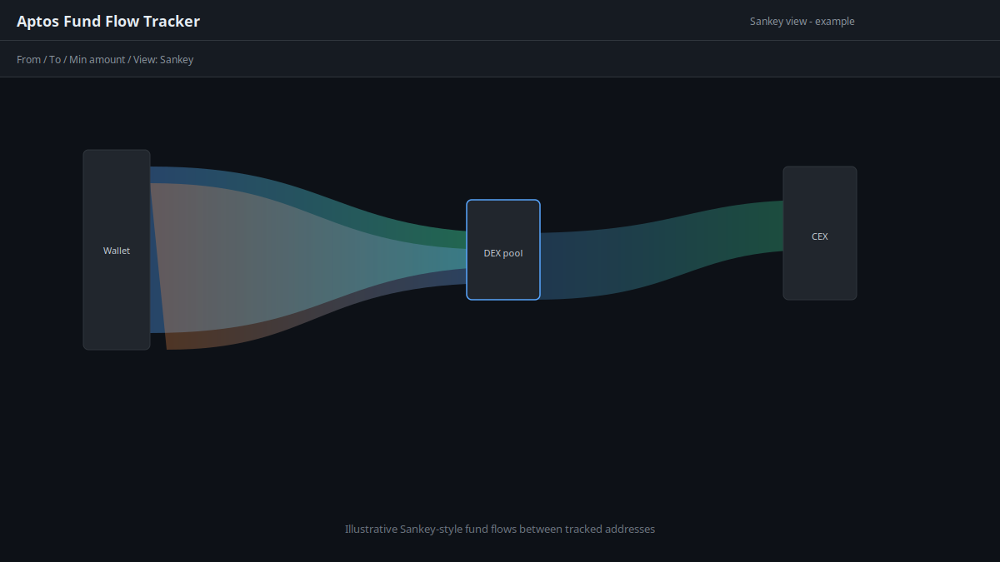
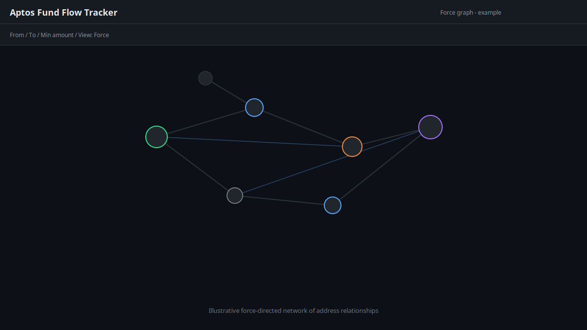

# Aptos Fund Flow Tracker

[](LICENSE)

A CLI + web application for tracking and visualizing fund flows across Aptos blockchain addresses. Syncs on-chain activity via the Aptos Indexer GraphQL API, stores it locally in SQLite, and renders interactive Sankey diagrams and force-directed graphs.

## Features

- **Address tracking** — Monitor multiple Aptos addresses with optional aliases
- **Transaction sync** — Fetch fungible asset activities from the Aptos Indexer with time-range scoping
- **Flow visualization** — Interactive Sankey diagrams and force-directed graphs (D3.js)
- **Well-known labels** — Built-in registry of known DEXes, exchanges, bridges, protocols, and more
- **Boundary detection** — Auto-detect contracts, exchanges, and pools via heuristics
- **Tax categorization** — Classify transactions by entry function patterns (swap, stake, bridge, etc.)
- **Label import/export** — Share label sets as JSON files
- **Aptos Name Service** — Resolve `.apt` names when adding addresses

## Demo

The clip below alternates between the Sankey and force graph views (illustrative previews in the app’s dark theme). Source art lives under [`docs/media/`](docs/media/) if you want to refresh the assets.

<video src="docs/media/ui-demo.mp4" controls muted playsinline width="100%"></video>

### Example views

| Sankey (flows by volume) | Force graph (address network) |
| --- | --- |
|  |  |

## Quick Start

```bash
# Install dependencies
pnpm install

# Add an address to track
pnpm dev add 0xYOUR_ADDRESS --alias "My Wallet"

# Sync on-chain activity (optionally scoped to a date range)
pnpm dev sync
pnpm dev sync --from 2025-01-01 --to 2025-03-01

# Launch the web UI
pnpm serve
# → http://localhost:3000
```

## CLI Commands

```
aptos-tracker add <address> [--alias <name>]     Add an address to track
aptos-tracker remove <address>                   Stop tracking an address
aptos-tracker list                               List tracked addresses
aptos-tracker sync [options]                     Sync activities from the indexer
  --address <addr>                               Sync only this address
  --full                                         Full re-sync from the beginning
  --auto-expand                                  Auto-track discovered non-boundary addresses
  --from <date>                                  Only fetch activities on or after this date
  --to <date>                                    Only fetch activities on or before this date
aptos-tracker label <address> --type <type>      Label an address
  types: dex_pool, exchange, bridge, contract, user, staking_pool, lending_pool
aptos-tracker labels                             List all address labels
aptos-tracker detect                             Run auto-detection heuristics
aptos-tracker serve [--port <port>]              Start the web UI (default: 3000)
aptos-tracker export [-o <file>]                 Export transfers to CSV
```

## Web UI

The web interface provides:

- **Sankey diagram** — Shows flow of funds between addresses, sized by volume
- **Force graph** — Network visualization of address relationships
- **Filters** — Date range, minimum amount, asset type, direction, tax category
- **Context menu** — Right-click any node to label it, set boundaries, copy address, or open in explorer
- **Address panel** — Manage tracked addresses with editable aliases
- **Well-Known Labels panel** — Browse and search the built-in registry of known Aptos addresses
- **Sync** — Trigger syncs from the UI (respects current date range filters)
- **Import/Export** — Save and load label sets as JSON

## Configuration

Create a `.env` file in the project root:

```env
# Aptos Indexer GraphQL endpoint (default: mainnet)
APTOS_GRAPHQL_URL=https://api.mainnet.aptoslabs.com/v1/graphql

# API key for the Aptos Indexer (optional, increases rate limits)
APTOS_API_KEY=your_key_here

# SQLite database path (default: ./aptos-tracker.db)
DB_PATH=./aptos-tracker.db

# Web server port (default: 3000)
PORT=3000
```

## Well-Known Labels

The project includes a built-in registry of known Aptos addresses at `src/labels/well-known.ts`. These are automatically seeded into the database on startup and browsable from the web UI.

Categories include: DEX, Exchange, Bridge, Lending, Staking, NFT Marketplace, Protocol, and Infrastructure.

To add a new well-known address, append an entry to the `WELL_KNOWN` array:

```ts
{
  address: '0x...',
  label_type: 'dex_pool',
  label_name: 'MyDEX',
  is_boundary: 1,
  category: 'DEX',
  description: 'MyDEX AMM router',
}
```

## Project Structure

```
src/
  index.ts                  CLI entry point (commander.js)
  config.ts                 Environment config (.env loader)
  api/
    server.ts               Express server setup
    routes/                 REST API endpoints
      addresses.ts          Address CRUD
      graph.ts              Sankey/force graph data
      labels.ts             Label management + well-known registry
      sync.ts               Sync control
      tax.ts                Tax category management
      transfers.ts          Transfer queries
  db/
    connection.ts           SQLite connection (better-sqlite3, WAL mode)
    schema.ts               Database schema
    queries.ts              All DB query functions
  frontend/
    app.ts                  Main UI controller
    api-client.ts           Typed API client
    sankey-view.ts          D3 Sankey renderer
    force-view.ts           D3 force graph renderer
    context-menu.ts         Right-click menu + tooltips
    controls.ts             Filter controls + state persistence
    tx-modal.ts             Transaction detail modal
  ingestion/
    client.ts               GraphQL client with retry/backoff
    fetcher.ts              Paginated activity fetcher
    correlator.ts           Activity → transfer correlation
    sync.ts                 Sync orchestration
    boundary.ts             Boundary checking
  labels/
    well-known.ts           Well-known address registry
    seed.ts                 Database seeder
    manager.ts              Label CRUD helpers
    detector.ts             Auto-detection heuristics
  tax/
    categories.ts           Entry function → tax category matching
    seed.ts                 Tax category seed data
  tokens/
    registry.ts             Token metadata registry
  ans/
    resolver.ts             Aptos Name Service resolution
public/
  index.html                Single-page app shell
  css/styles.css            Dark theme styles
  js/bundle.js              Compiled frontend (esbuild output)
```

## Development

```bash
# Build everything (frontend + backend)
pnpm build

# Build frontend only
pnpm build:frontend

# Type checking
pnpm typecheck

# Lint + format
pnpm check
```

## Tech Stack

- **Runtime**: Node.js (ES2022 modules)
- **Language**: TypeScript (strict)
- **Backend**: Express.js
- **Database**: SQLite via better-sqlite3 (WAL mode)
- **Frontend**: Vanilla TypeScript + D3.js v7 (bundled with esbuild)
- **Data source**: Aptos Indexer GraphQL API
- **CLI**: commander.js
- **Linting**: Biome
